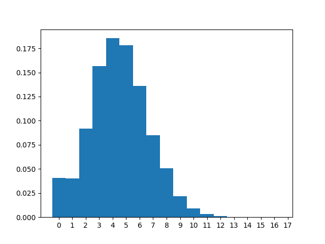
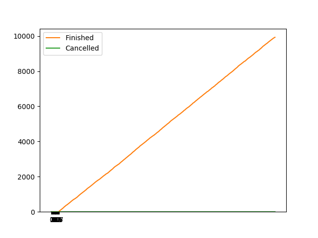
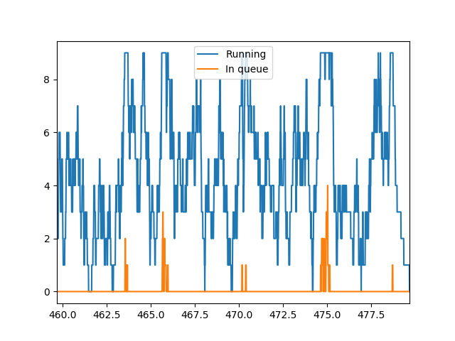

# Статистика
λ = 24.00

μ = 4.80

n = 9, m = 8

|                  |   count |      mean |     std |   min |   25% |   50% |   75% |   max |
|:-----------------|--------:|----------:|--------:|------:|------:|------:|------:|------:|
| Размер очереди   |   47967 | 0.0201597 | 0.19109 |     0 |     0 |     0 |     0 |     5 |
| Занятые каналы   |   47967 | 4.46357   | 2.12301 |     0 |     3 |     4 |     6 |     9 |
| Заявки в системе |   47967 | 4.48373   | 2.17407 |     0 |     3 |     4 |     6 |    14 |

Всего отменено: 0

Всего выполнено: 9928

Вероятности для состояний системы:

|                           |          0 |         1 |         2 |        3 |        4 |        5 |        6 |         7 |         8 |         9 |         10 |         11 |          12 |          13 |          14 |          15 |          16 |          17 |
|:--------------------------|-----------:|----------:|----------:|---------:|---------:|---------:|---------:|----------:|----------:|----------:|-----------:|-----------:|------------:|------------:|------------:|------------:|------------:|------------:|
| Теоретическая вероятность | 0.00676763 | 0.0338382 | 0.0845954 | 0.140992 | 0.17624  | 0.17624  | 0.146867 | 0.104905  | 0.0655656 | 0.0364253 | 0.0170744  | 0.00692205 | 0.00247216  | 0.000788987 | 0.000227592 | 5.98927e-05 | 1.44902e-05 | 3.24407e-06 |
| Практическая вероятность  | 0.0405696  | 0.0401735 | 0.0917089 | 0.156357 | 0.185482 | 0.178414 | 0.13601  | 0.0849751 | 0.0507641 | 0.021765  | 0.00900619 | 0.00352326 | 0.000938145 | 0.00027102  | 4.16953e-05 | 0           | 0           | 0           |

Данный график демонстрирует рост числа выполненных и отменённых заявок со временем:

Данный график демонстрирует количество заявок в каналах и очереди в течение времени выполнения:

|                                      |        Теор. |     Практ. |
|:-------------------------------------|-------------:|-----------:|
| Вероятность отказа                   |  3.24407e-06 |  0         |
| Относительная пропускная способность |  0.999997    |  1         |
| Абсолютная пропускная способность    | 23.9999      | 24         |
| Длина очереди                        |  0.0431156   |  0.0201597 |
| Количество занятых каналов           |  4.92812     |  4.46357   |
| Количество заявок в системе          |  4.97124     |  4.48373   |

|                         |   count |       mean |       std |   min |   25% |   50% |   75% |   max |
|:------------------------|--------:|-----------:|----------:|------:|------:|------:|------:|------:|
| Время запроса в очереди |    9928 | 0.00076249 | 0.0062448 |  0    |  0    |  0    |  0    |  0.14 |
| Время запроса в системе |    9928 | 0.216419   | 0.214751  |  0.01 |  0.07 |  0.15 |  0.29 |  2.68 |

|                                             |   Значение |
|:--------------------------------------------|-----------:|
| Теор. среднее время пребывания заявки в СМО |   0.333333 |

