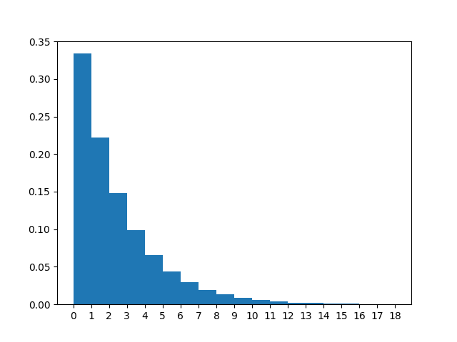
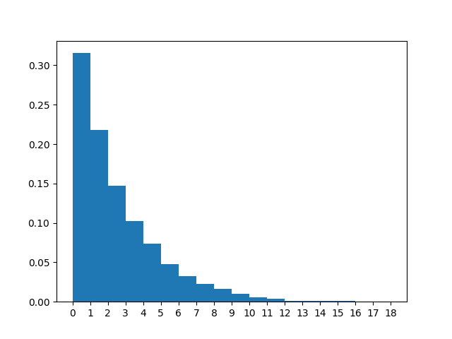
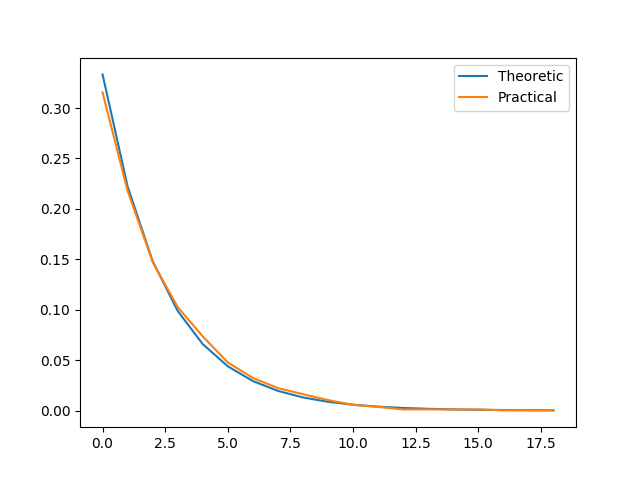
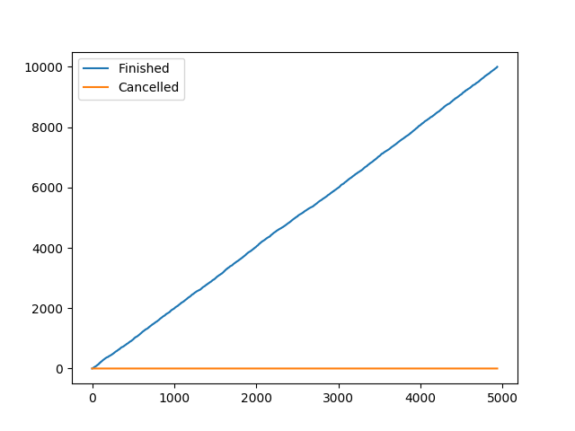
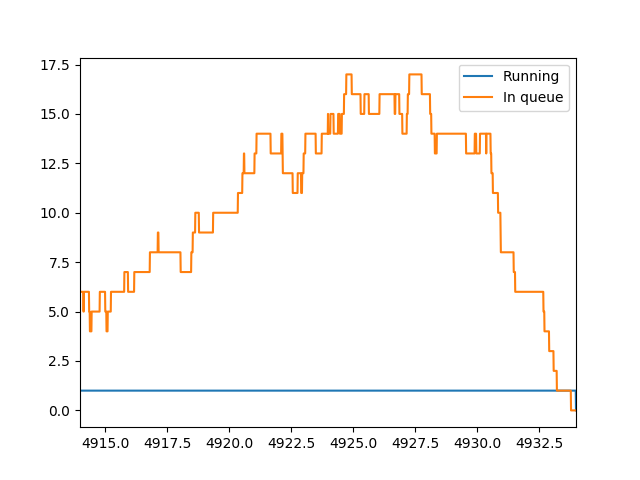

# Статистика
λ = 5.00

μ = 3.00

n = 10000

|                  |   count |     mean |     std |   min |   25% |   50% |   75% |   max |
|:-----------------|--------:|---------:|--------:|------:|------:|------:|------:|------:|
| Размер очереди   |  493399 | 1.40881  | 2.18164 |     0 |     0 |     0 |     2 |    17 |
| Занятые каналы   |  493399 | 0.684564 | 0.46469 |     0 |     0 |     1 |     1 |     1 |
| Заявки в системе |  493399 | 2.09337  | 2.42162 |     0 |     0 |     1 |     3 |    18 |

Всего отменено: 0

Всего выполнено: 10000

Теоретические вероятности для состояний системы:

Практические вероятности для состояний системы:

Сравнительный график теор. и практ. вероятностей системы:

|                           |        0 |        1 |        2 |         3 |         4 |         5 |         6 |         7 |         8 |          9 |         10 |         11 |         12 |         13 |         14 |          15 |          16 |          17 |          18 |
|:--------------------------|---------:|---------:|---------:|----------:|----------:|----------:|----------:|----------:|----------:|-----------:|-----------:|-----------:|-----------:|-----------:|-----------:|------------:|------------:|------------:|------------:|
| Теоретическая вероятность | 0.333333 | 0.222222 | 0.148148 | 0.0987654 | 0.0658436 | 0.0438957 | 0.0292638 | 0.0195092 | 0.0130061 | 0.00867076 | 0.00578051 | 0.00385367 | 0.00256912 | 0.00171274 | 0.00114183 | 0.000761219 | 0.00050748  | 0.00033832  | 0.000225546 |
| Практическая вероятность  | 0.315436 | 0.217919 | 0.147278 | 0.102627  | 0.0734781 | 0.0477078 | 0.0323369 | 0.022268  | 0.0162282 | 0.0104175  | 0.00557561 | 0.00358736 | 0.00110053 | 0.00116741 | 0.00102149 | 0.00108229  | 0.000257398 | 0.000364816 | 0.000145927 |

Данный график демонстрирует рост числа выполненных и отменённых заявок со временем:

Данный график демонстрирует количество заявок в каналах и очереди в течение времени выполнения:

|                                      |    Теор. |   Практ. |
|:-------------------------------------|---------:|---------:|
| Вероятность отказа                   | 0        | 0        |
| Относительная пропускная способность | 1        | 1        |
| Абсолютная пропускная способность    | 2        | 2        |
| Длина очереди                        | 1.33333  | 1.40881  |
| Количество занятых каналов           | 0.666667 | 0.684564 |
| Количество заявок в системе          | 2        | 2.09337  |

|                         |   count |     mean |      std |   min |   25% |   50% |   75% |   max |
|:------------------------|--------:|---------:|---------:|------:|------:|------:|------:|------:|
| Время запроса в очереди |   10000 | 0.695104 | 0.92617  |  0    |  0    |  0.33 |  1.05 |  6.44 |
| Время запроса в системе |   10000 | 1.03287  | 0.982703 |  0.01 |  0.31 |  0.74 |  1.45 |  6.92 |

|                                                 |   Значение |
|:------------------------------------------------|-----------:|
| Теор. среднее время пребывания заявки в очереди |   0.666667 |
| Теор. среднее время пребывания заявки в СМО     |   1        |

|                                         |   Значение |
|:----------------------------------------|-----------:|
| Сумма штрафа за сутки при S = 10 рублей |      82.56 |

